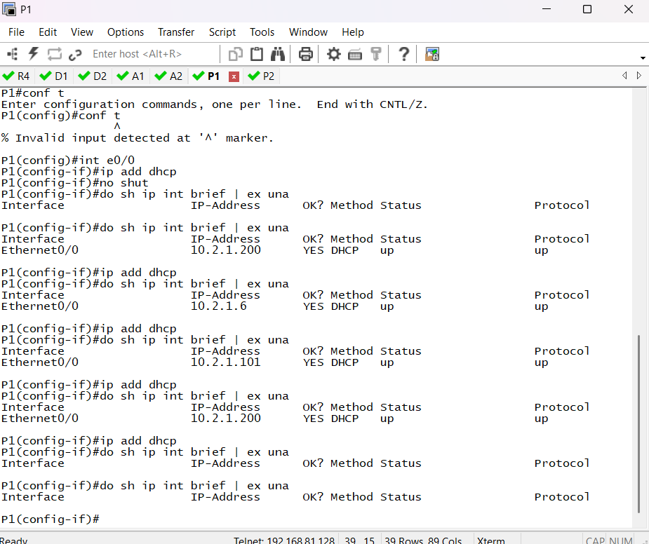
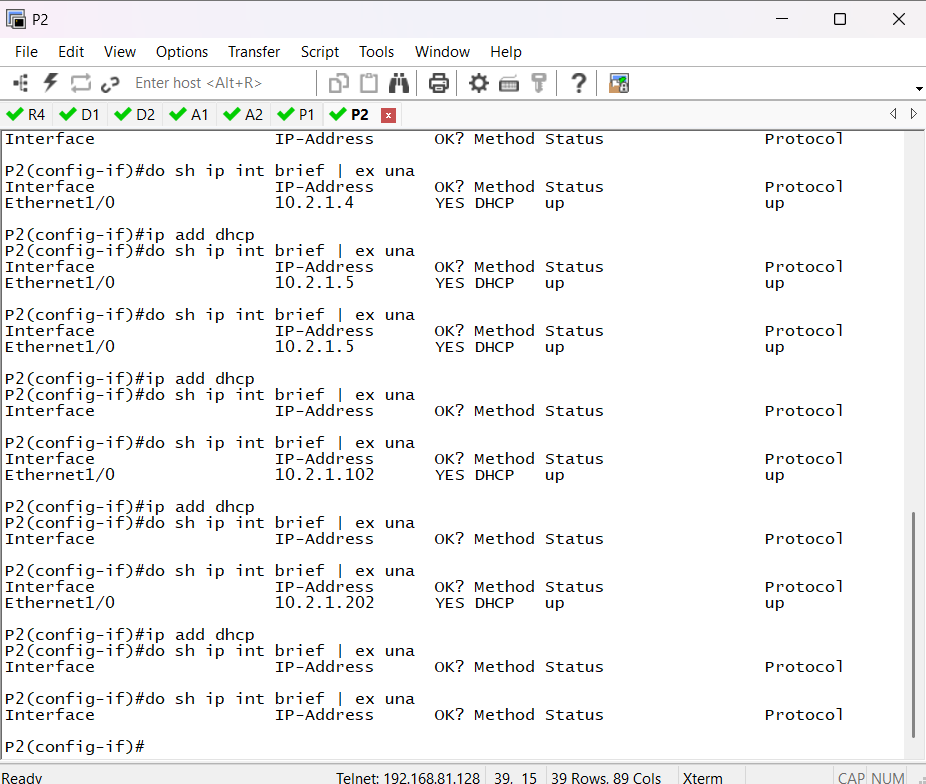
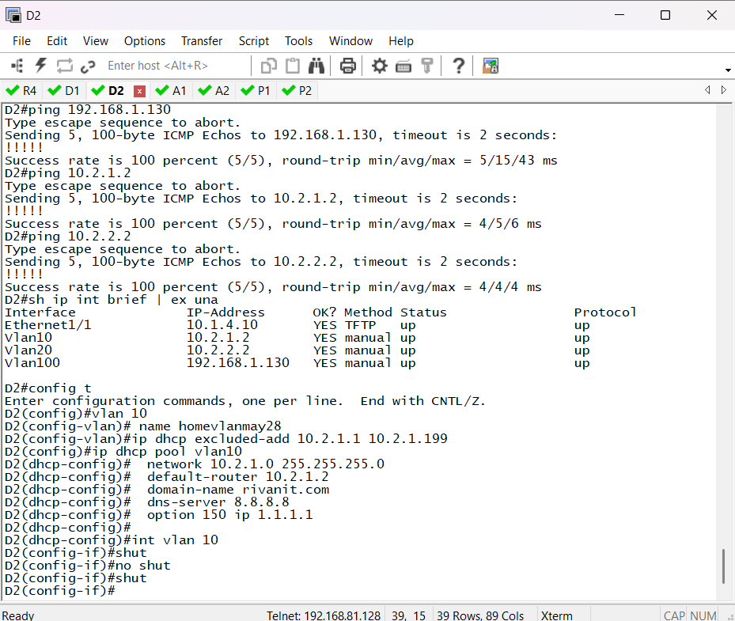
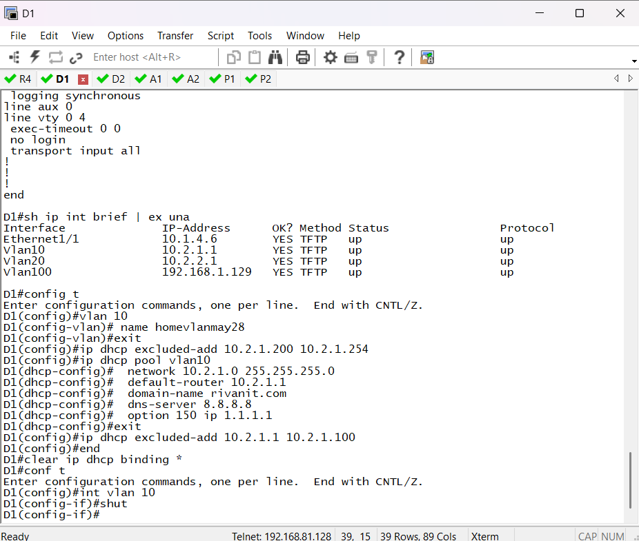

# First Home Work

## Configuring RSTHayupV4

This configuration sets up all the devices in RSTHayup file

### First Assignment (R4): Configure R4:

Commands:
~~~
enable 
conf t
hostname R4 (adding name to the router)
enable secret password
service password-encryption (make password encrypted)
no logging console
no ip domain-lookup

int e1/2 (ethernet port of R4)
no shutdown (turn on port)
ip add 10.1.1.10 255.255.252 (add ip address and subnet for the router)

int e1/0 
no shut 
ip add 10.1.4.5 255.255.255.252

int e1/1
no shut 
ip add 10.1.4.9 255.255.255.252

do show ip int brief | ex una  (shows the ip brief information "do" word is like a sudo that gives permission inside config t)
~~~

### Second Assignment (D2): Configure D2:

~~~
conf t
hostname D2 
enable secret pass
service password-encryption
no logging cons
no ip domain-lookup
line cons 0 
login
password pass
exec-timeout 0 0
line vty 0 4
password pass
login
exec-timeout 0 0
int e1/1
ip add 10.1.4.10 255.255.255.252

int vlan 10 
ip add 10.2.1.2 255.255.255.252
no shut

int vlan 20 
ip add 10.2.2.2 255.255.255.252
no shut

int vlan 100
ip add 192.168.1.130 255.255.255.128
no shut 
~~~

### Third Assignment (A2): Configure A1:
~~~
conf t
hostname A12enable secret pass
service password-encryption
no logging cons
no ip domain-lookup
line cons 0 
login
password pass
exec-timeout 0 0
line vty 0 4
password pass
login
exec-timeout 0 0
int e1/1
ip add (add ip address)
no shut 
~~~
### Forth part: P (Give ip address to P1, P2 via DHCP sever on D1/D2 using load balance)

~~~
!D1: will give .101 - .199

config t
vlan 10 
 name homevlanmay28
exit
ip dhcp excluded-add 10.2.1.1 10.2.1.100
ip dhcp pool vlan10
  network 10.2.1.0 255.255.255.0
  default-router 10.2.1.1
  domain-name rivanit.com
  dns-server 8.8.8.8
  option 150 ip 1.1.1.1
~~~
~~~
!D2: will give .200 - .249

config t
vlan 10
 name homevlanmay28
ip dhcp excluded-add 10.2.1.1 10.2.1.199
ip dhcp pool vlan10
  network 10.2.1.0 255.255.255.0
  default-router 10.2.1.2
  domain-name rivanit.com
  dns-server 8.8.8.8
  option 150 ip 1.1.1.1
~~~
### Task3 a1, a2: hingi vlan and lipat port: 
A1: 
~~~
conf t
int e0/0 
switchport mode access 
switchport access vlan 10
do sh vlan br
~~~
A2:
~~~
conf t
int e1/0 
switchport mode access
switchport access vlan 10
do sh vlan br
~~~

p1: 
~~~
conf t
int e0/0
ip add dhcp 
no shut
do sh ip int brief | ex una
~~~
p2: 
~~~
conf t
int e1/0
ip add dhcp 
no shut
do sh ip int brief | ex una 
~~~
## Documentation of the Assignament

### Documentaion 1

### Documentaion 2

### Documentaion 3

### Documentaion 4

